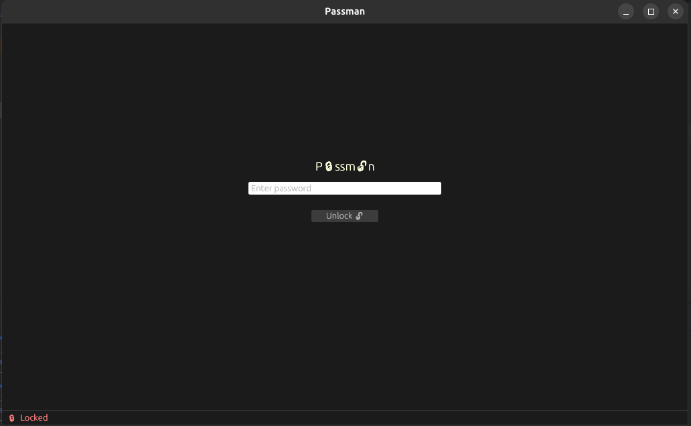
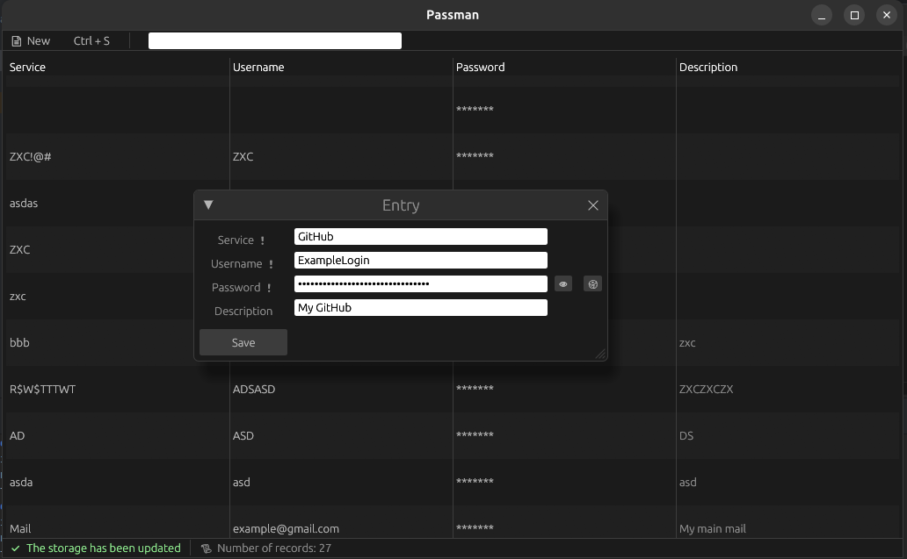

# 🛡️ Passman

**Passman** — это лёгкий и безопасный менеджер паролей, написанный на **Rust** с использованием `egui`.  
Он хранит все ваши пароли локально, шифрует их с помощью **AES-256-GCM**,  
а ключ доступа защищается **Argon2** — современным алгоритмом деривации паролей.

---

## 🚀 Возможности

- 🔒 **AES-256-GCM** шифрование записей
- 🧂 **Argon2** деривация мастер-ключа с уникальной солью
- 🪶 **egui**-интерфейс: простой, нативный, кроссплатформенный
- 🧰 Система статусов и уведомлений (UI-панель внизу окна)
- 🧭 Быстрый поиск, копирование полей в буфер, редактирование и удаление записей

---

## 🧱 Установка

### 📦 Сборка из исходников

```bash
git clone https://github.com/<your_username>/passman.git
cd passman
cargo build --release
```

## 🧑‍💻 Пример интерфейса

